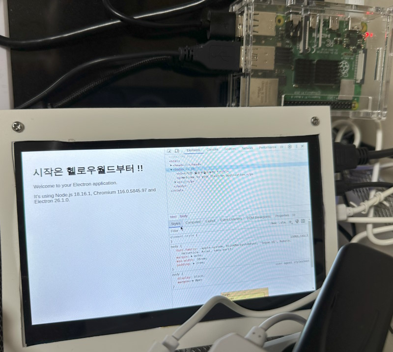

# electron-kiosk

일렉트론으로 키오스크 만들기 템플릿

라즈베리파이에서 사용하기 위해 만들어 봤는데, 기본OS에 설치되는 크로뮴 브라우저를 써도 되지만 일부 기능 구현에 어려움이 있을 것이 예상되어 일렉트론으로 대체가 가능한지 테스트하기 위함



전체화면으로 창을 띄우는데 키보드의 alt 를 누르면 시스템 메뉴에 접근할 수 있음

## Getting started

[Electron app with Webpack, Bootstrap, FontAwesome and JQuery - A complete guide](https://dev.to/theola/electron-app-with-webpack-bootstrap-fontawesome-and-jquery-a-complete-guide-54k2)

[Repo](https://github.com/theolazian/electron-webpack-bootstrap-fontawesome-jquery/)

```
npm install --global yarn
yarn create electron-app electron-kiosk --template=webpack
```

### Start app

```
yarn start
```

### Building distributables

arm64 linux와 크로스 빌드하기 위해서는 `packages.json`과 `forge.config.js` 에서 rpm, deb 관련내용 몽땅 삭제하고 zip만 남긴다.

make 명령은 exe 설치파일 또는 rpm, deb까지 만들고 package 명령은 단순하게 파일 빌드만 한다.

```
yarn run make

# arm linux (no exe)
yarn run package -- --arch arm64 --platform linux

yarn run package:pi
```

### Publishing

publish는 특정 사이트로 업로드한다.

```
yarn run publish
```
